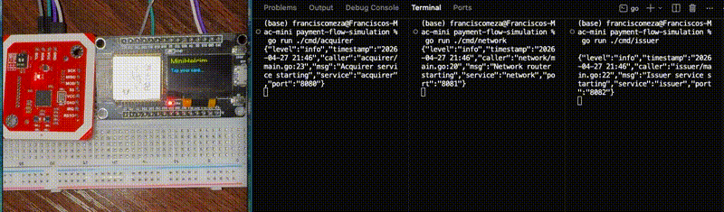

# Simulated Merchant's Payment Terminal

A hardware + software simulation of a real card payment flow, built as a portfolio project targeting Helcim's engineering team.

A physical NFC card is tapped on an ESP32 terminal, which triggers a full authorization cycle across three simulated Go services — acquirer, card network router, and issuer — mirroring how real payments work in production.

---

## Architecture

```
[ESP32 + PN532 Terminal]
        |
        | HTTP POST /authorize
        v
[Acquirer Service :8080]
        |
        | HTTP POST /route
        v
[Network Router :8081]
        |
        | HTTP POST /authorize
        v
[Issuer Service :8082]
        |
        | approve / decline
        v
[Network Router :8081]
        |
        v
[Acquirer Service :8080]
        |
        | HTTP response
        v
[ESP32 Display — APPROVED / DECLINED]
```

---

## Demo



## Hardware

| Component | Details |
|---|---|
| ESP32 board | With onboard SSD1306 OLED display |
| PN532 NFC module | POCREATION kit — I2C mode |
| MIFARE Classic 1K card | UID: 1B:5E:32:07 |
| MIFARE keyfob | UID: 2E:F8:14:07 |

**Wiring (I2C):**

| PN532 Pin | ESP32 Pin |
|---|---|
| VCC | 3.3V |
| GND | GND |
| SDA | D21 |
| SCL | D22 |

---

## Services

### Acquirer (port 8080)
Simulates the merchant's bank. Receives the auth request from the terminal, validates the merchant exists and is active, then forwards the request to the network router. Returns the final approve/decline back to the terminal.

### Network Router (port 8081)
Simulates Visa/Mastercard. Routes the request to the correct issuer based on card prefix. Adds a small artificial latency to simulate real network conditions.

### Issuer (port 8082)
Simulates the cardholder's bank. Holds the card database, checks balance, runs fraud rules, and makes the approve/decline decision.

---

## Fraud Rules (Issuer)

- Blocked card status → decline
- Insufficient balance → decline
- Amount > $1,000 → decline (velocity rule)
- Unknown card UID → decline

---

## Project Structure

```
minihelcim/
├── cmd/
│   ├── acquirer/       # Acquirer service (port 8080)
│   ├── network/        # Network router (port 8081)
│   └── issuer/         # Issuer service (port 8082)
├── internal/
│   ├── models/         # Shared structs (Card, Transaction, AuthRequest, AuthResponse)
│   ├── fraud/          # Fraud rule engine
│   └── db/             # SQLite card and merchant store
├── esp32/
│   └── terminal.ino    # Arduino sketch for the physical terminal
├── go.mod
└── README.md
```

---

## Getting Started

### Prerequisites

- Go 1.22+
- Arduino IDE with ESP32 board support
- Adafruit PN532 library
- ThingPulse SSD1306Wire library

### Run the backend

```bash
# Terminal 1 — Issuer
go run ./cmd/issuer

# Terminal 2 — Network router
go run ./cmd/network

# Terminal 3 — Acquirer
go run ./cmd/acquirer
```

### Flash the ESP32

Open `esp32/terminal.ino` in Arduino IDE, set your WiFi credentials and acquirer IP, then upload to the board.

### Test without hardware

```bash
curl -X POST http://localhost:8080/authorize \
  -H "Content-Type: application/json" \
  -d '{"card_uid":"1B:5E:32:07","merchant_id":"M001","amount":24.99}'
```

---

## Simulated Accounts

| Card | Holder | Balance | Status |
|---|---|---|---|
| 1B:5E:32:07 | Hely Cimer | $500.00 | active |
| 2E:F8:14:07 | Jane Smith | $23.50 | active |

---

## Tech Stack

| Layer | Technology |
|---|---|
| Terminal firmware | C++ (Arduino) |
| Backend services | Go 1.22 |
| Database | SQLite |
| Transport | HTTP/JSON |
| Hardware | ESP32, PN532, SSD1306 |

---

## Why this project

Helcim builds payment infrastructure in Go for Canadian and US merchants. This project simulates the core of what Helcim does — card present transactions, authorization routing, and merchant services — using the same language and a real physical terminal. It was built to demonstrate both payments domain knowledge and Go backend fundamentals.

---

## Author

Built by Francisco — Calgary, AB  
Portfolio project targeting Helcim Engineering